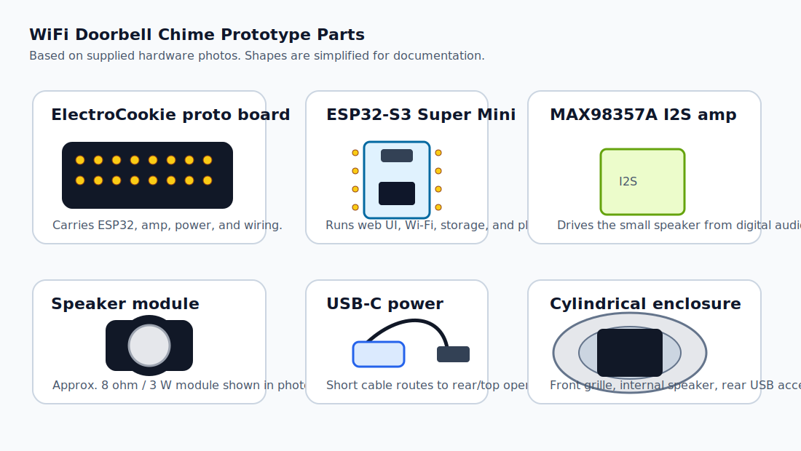
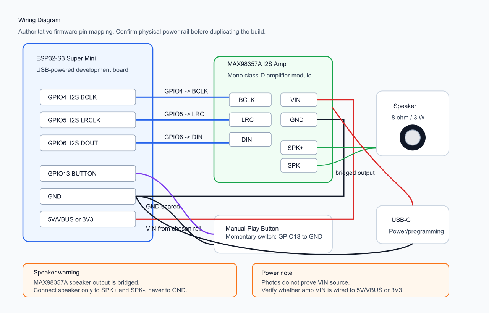
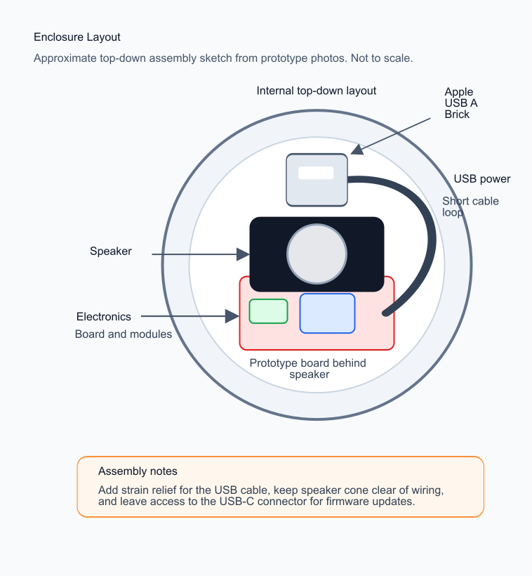

# Hardware Diagrams

These diagrams are based on the current prototype photos and the firmware pin
assignments. Verify exact solder connections against the physical build before
reproducing.

## Component Overview

Visible prototype parts:

- ESP32-S3 Super Mini development board
- MAX98357A I2S mono amplifier module
- Small 8 ohm / 3 W speaker module
- ElectroCookie prototype board
- Short USB-C cable and USB power adapter
- Cylindrical enclosure with front speaker grille and internal rear USB access

## Wiring

Firmware pin assignments:

- I2S bit clock: `GPIO4`
- I2S word select / LRCLK: `GPIO5`
- I2S data out: `GPIO6`
- Manual play button: `GPIO13` to ground, using `INPUT_PULLUP`
- Onboard indicator LED: `GPIO48`

The MAX98357A speaker output is bridged. Connect the speaker only to the amp
module speaker terminals, not to ground.

## Enclosure Layout

The enclosure photos show a round front grille, internal speaker mounted near
the front opening, a prototype board behind it, and a USB-C cable routed toward
the rear/top opening for power and programming.

## Notes For Next Revision

- Add a labeled internal photo after final soldering.
- Confirm whether amplifier power is taken from ESP32 5 V/VBUS or 3.3 V.
- Add a strain-relief detail for the short USB-C cable.
- Add a physical admin-password recovery gesture if the button placement allows
  a reliable boot-time hold.
